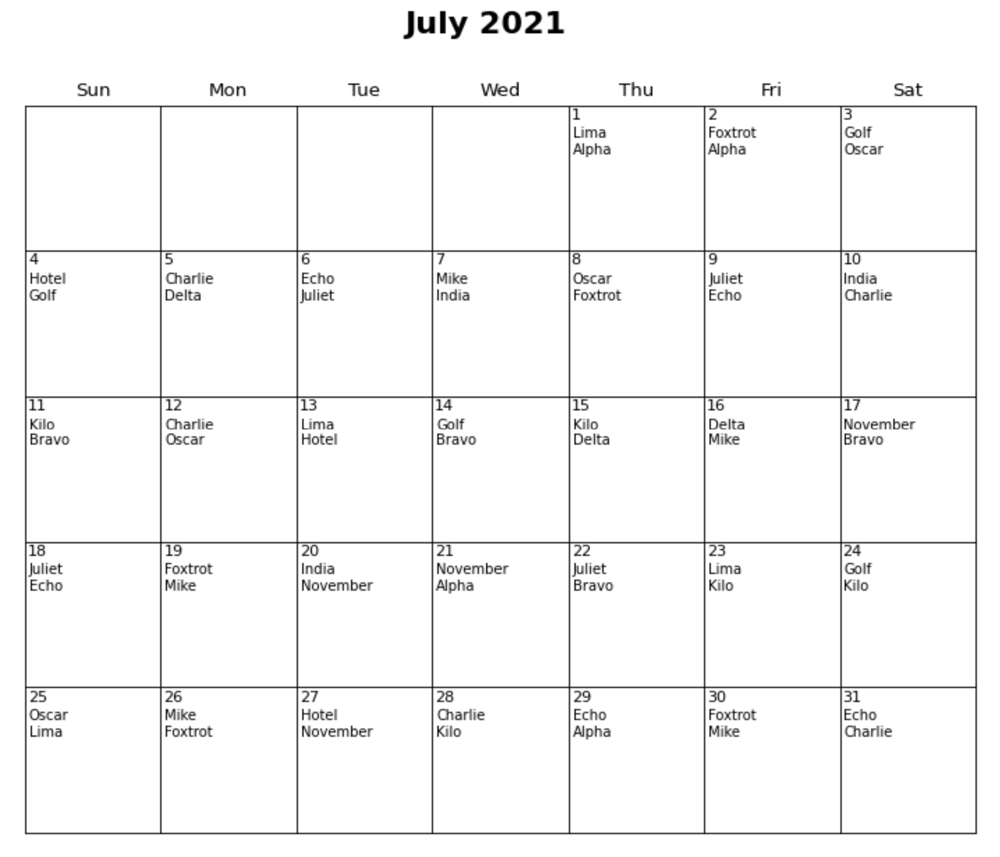
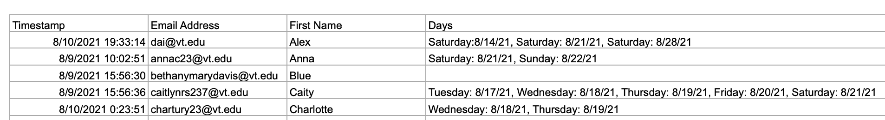
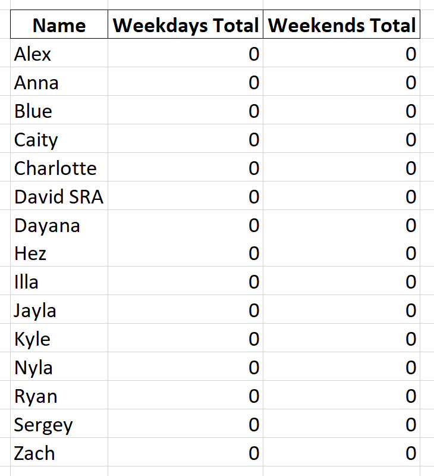

# Automated Duty Scheduler
Create a Duty Schedule in seconds!

**Author:** David Peterson - dpeterson23@vt.edu

**Version:** V1.4 01-04-2022

V1.1 - Partnerships Added - program prioritizes matching you with new staff members

V1.2 - Custom number of staff for weekdays/weekends

V1.3 - History Added - automatically import cumulative number of worked weekdays/weekends

V1.4 - Enhanced user input procedures, automatic refreshing calendar, ensure at least 5 days between scheduled days

If you experience any bugs/errors or would like to suggest an improvement, please contact me by emailing dpeterson23@vt.edu

# How to Use
1) Download Python (Free)
2) Create your Availability Excel file and History Excel in the correct format
3) Save the Availability Excel file in the correct location and run the program once a month
4) View your automatically created duty schedule in a calendar like this!

## Set-Up
You only have to do these steps for a first-time set-up.

**Install Python**
1) If you do not have a version of Python installed on your computer, download it here: https://www.python.org/downloads/
2) Once Python is downloaded, go here: https://github.com/dpetersonVT23/Duty-Scheduler
3) Click on the green "Code" button, it will drop down with an "HTTPS" link, click the clipboard to copy this link (it will confirm you copied it)
4) Open Command Prompt (hit Windows Start Button and search for Command Prompt)
5) On the Command Prompt, execute the command: git clone <link copied in step 3>
6) On the Command Prompt, execute the command: pwd
- This is where the duty scheduler will be saved, it is typically /c/Users/\<your username\>, remember this for future steps.

**Installing Packages**  
This program needs support from external libraries to function correctly. On the Command Prompt, execute the following commands:

- pip install pandas
- pip install matplotlib
- pip install openpyxl

## Preparing to Run the Program
Create a Google form that allows residents to choose which dates they are **not** available. Please see this example form for August (credit Illa Rochez): https://forms.gle/52GgyagZQwaKjq4h9 - You will see a section to mark days UNAVAILABLE, the program uses days an individual is UNAVAILABLE to schedule.

Please ensure the options for selecting when an individual is busy is formatted as "DAY NAME: MONTH/DAY/YEAR". (e.g., Sunday: 08/15/2021)

You will be able to export data from the Google form responses to be used as the Availability Excel file for the program. This is what the output file might look like, however, there are some things you want to make sure of before inputting it to the program.

1) Ensure the column header for the Names is "First Name"
2) Ensure the column header for the days the individual is not available is "Days"
3) Ensure the name of the Availability Excel file is "monthName_buildingCommunityCode.xlsx" - (The building code is ultimately up to you, just remember how you name the file for when you run the program as you will be prompted for the building code in the terminal - see existing examples in the Availability directory - ensure the month name is LOWERCASE and the building/community code is UPPERCASE)

Locate where in your file explorer saved the duty scheduler. Open the Duty-Scheduler folder. Here you will see an Availability folder and a History folder, this is where you will place your Excel files that manage availability for individuals and cumulative weekdays/weekends worked.

Save the Availability Excel file here. Now it is time to set up the History Excel file. The purpose of this file is to automatically track how many weekdays/weekends each individual on your staff works so that it can be most accurately balanced over the course of the semester. Please reference the image below to set-up your History Excel file (you only have to do this once as this file updates automatically every time the program is run). If you are starting mid-semester with this program, instead of filling in both columns with all zeros, you can fill in the current amount of weekdays/weekends worked for each of your staff so the program can best balance duty scheduling for your staff for the remainder of the semester. Please name the column headers exactly how they appear in the image below for the program to work correctly. Also, please ensure the name of the History Excel file is "buildingCommunityCode_hist.xlsx", where the building/community code is UPPERCASE.  

ENSURE THE NAMES FROM THE AVAILABILITY EXCEL FILE MATCH THE NAMES FROM THE HISTORY EXCEL FILE!!!

## Running the Program
Now to run the program! Open the command prompt and run the command "cd Duty-Scheduler", then run the command "python main.py", fill in the prompts in the terminal accordingly, and your Calendar will pop-up and automatically be saved to the Schedule folder for you to access and share with your staff! In addition, your History Excel file will be updated with a running sum of worked weekdays/weekends automatically and will use these values to appropiately assign a balanced duty schedule over the course of the semester/year.

**IMPORTANT NOTE:** The program will automatically save the calendar and update the History Excel file.

**Run Output:** You will see a series of outputs after you run the program providing you additional information about your newly generated Duty Calendar. From top to bottom, you will find a list of the staff members on duty each day (Staff Member Scheduled Dates), the cumulative number of weekdays/weekends each staff member has been scheduled at that point in the semester (Staff Member Weekday/Weekend Counts), the number of unique staff members each staff member is partnered up with on duty (along with who specifically these unique staff members are) (Staff Member Partnerships), and the number of days the staff member submitted that they were available for a given month (Staff Member Availability)!

# Advanced Tips

## Not Enough Candidates Warning
If you get a warning that looks like this in the "Run" tab at the bottom of the PyCharm IDE, this means there are not enough staff members available for duty on the specified day. A warning like this may appear as the following:

NOT ENOUGH CANDIDATES FOR JULY 22 (WEEKDAY) - Currently have 1 candidate(s) | Candidates: [nameOfCurrentCandidates]

This means that on July 22nd, only 1 of your staff members has noted that they are available for duty but you might need atleast 2 to be available. Reach out and find someone else who is willing to fill in and be the second staff member on duty for that day!
