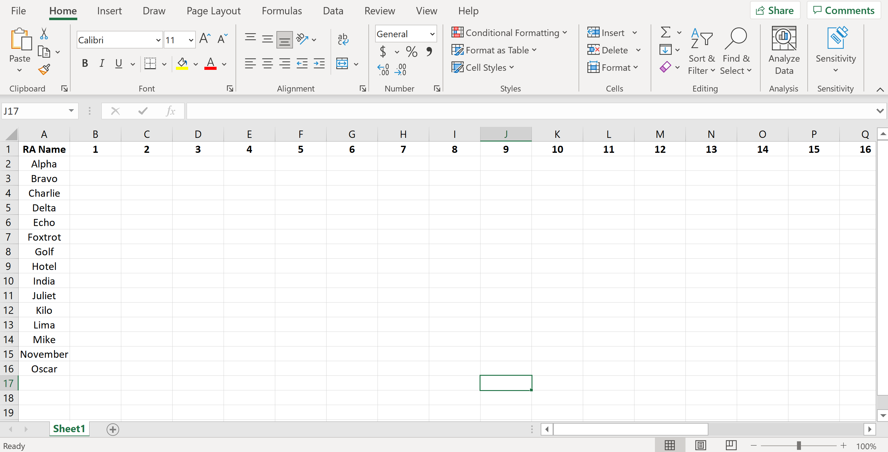
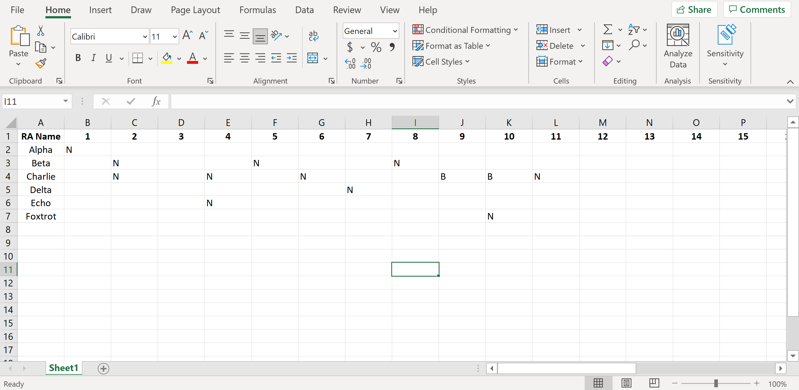

# Automated RA Duty Scheduler
Create an RA Duty Schedule in seconds!

**Author:** David Peterson - dpeterson23@vt.edu

**Version:** V1.0 07-22-2021

If you experience any bugs/errors or would like to suggest an improvement, please contact me by emailing dpeterson23@vt.edu

# How to Use
1) Download and Set-Up PyCharm (Free)
2) Create your Availability Excel file in the correct format
3) Save the Availability Excel file in the correct location and run the program
4) View your automatically created duty schedule in a calendar like this!

## PyCharm Set-Up
You only have to do these steps for a first-time set-up. The steps below are very general, if you have any trouble please reference this site for detailed instructions for set-up procedures with PyCharm (compatible with Windows and Mac): https://www.jetbrains.com/help/pycharm/quick-start-guide.html

If you have persistent trouble setting this up, feel free to email me and I am happy to help!

**Install Python/PyCharm IDE**
1) If you do not have a version of Python installed on your computer, download it here: https://www.python.org/downloads/
1) Go here: https://www.jetbrains.com/pycharm/download/ and download the PyCharm Community Edition (Free)
3) Once PyCharm is downloaded, go here: https://github.com/dpetersonVT23/RA_Duty_Scheduler
4) Click on the green "Code" button, it will drop down with an "HTTPS" link, click the clipboard to copy this link (it will confirm you copied it)
5) Open PyCharm, click "Get from Version Control" or "Get from VCS", paste the "HTTPS" link you just copied in the URL box
6) Set the directory on your computer in a location you know how to access in the Directory box
7) Click the "Clone" button

**Set-Up Python Interpreter**
1) Navigate to Settings (Windows)/Preferences (Mac), and click the dropdown menu next to "Project: RA_Duty_Scheduler"
2) Click on Python Interpreter
3) Click the gear icon in the upper-right => Add... => Virtualenv Environment => New Environment
4) Click the dropdown menu to select your "Base Interpreter" and select the option that corresponds with Python 3 (might appear as /usr/bin/python3)
5) Click OK and let it load, you should see "pip" and "setuptools" under packages, you are now ready to install the necessary packages for the program

**Installing Packages**

This program needs support from external libraries to function correctly, once your Python Interpreter is set-up, you can install these packages to ensure everything works correctly for you.

Click the + sign to install additional packages. Please search for and install the following packages:
- pandas
- matplotlib
- openpyxl

**Set-Up Python Configuration**

This is the last step, you are almost done with this one-time set-up!

1) On the main screen of the IDE (Integrated Development Environment), click "Add Configuration..." on the top
2) Click the + sign in the upper-left and click "Python"
3) You need to set 2 things under the Configuration menu: Script Path + Python Interpreter
4) Set the script path to main.py - locate where you put the "RA_Duty_Scheduler" program by clicking the folder icon, click main.py, and click open
5) Set the Python Interpreter to the Interpreter you just made - the one you want to select will most likely have "RA_Duty_Scheduler" in parentheses () with Python 3.X next to it
6) Click OK and you're Python environment is all ready to go!

## Availability Excel File Set-Up
Set-up the outline for your excel file in accordance with this example image:

1) Ensure the top-left cell contains "RA Name"
2) Enter the days of the month into the following columns
3) Enter the names of the RAs under the cell with "RA Name"

Instructions for RAs to fill out availability correctly:
- BLANK CELL = AVAILABLE FOR DUTY
- N          = NOT AVAILABLE FOR DUTY
- B          = AVAILABLE IF NEEDED (BACKUP)

Please see example below for entering "NOT AVAILABLE FOR DUTY" and "BACKUP" entries:

**Tip:** Create a shareable Excel file to give to all your RAs and allow them to input availability by a certain date. Once that date is reached, save the Excel file in the correct location for the program to access it.

How to save in the correct location: Locate where in your file explorer you set-up the Python program when you clicked "Get from Version Control" or "Get from VCS". Open the RA_Duty_Scheduler folder, open the Availability folder, and save your Availability Excel file here.

Now to run the program! Open the program in PyCharm and locate LINE 42 in main.py, this contains the path to your Availability Excel file. Modify it so its name reflects the name of your Availability Excel file (currently it is set to the myAvailabilityExcelFile.xlsx file). Click the Green Play button and your Calendar will pop-up and automatically be saved to the Schedule folder for you to access and share with your RAs!

# Advanced Tips

## Partial Month Scheduling
Want to schedule only the first part or second part of the month? You can do that!

Modify Start Date: Open the program in PyCharm and locate LINE 31 in main.py, here you can change the duty scheduling start date. The default value is 1, representing the start of the month, but if you'd like to start scheduling duty on the 14th for example, set this value to 14.

Modify End Date: Open the program in PyCharm and locate LINE 32 in main.py, here you can change the duty scheduling end date. The default value is NUM_DAYS_MONTH (representing the number of days in the current month), representing the end of the month, but if you'd like to end scheduling duty on the 28th for example, set this value to 28 (this will include scheduling duty on the 28th).

## Not Enough Candidates Warning
If you get a warning that looks like this in the "Run" tab at the bottom of the PyCharm IDE, this means there are not enough RAs available for duty on the specified day. A warning like this may appear as the following:

NOT ENOUGH CANDIDATES FOR JULY 22 (WEEKDAY) - Currently have 1 candidate(s)

This means that on July 22nd, only 1 of your RAs has noted that they are available for duty but you need atleast 2 to be available. Check if any RA's have applied to be backups for this day in the Availability Excel file (if so, change B to N so program accepts their name, don't forget to save the Excel file), if not, reach out and find someone else who is willing to fill in and be the second RA on duty for that day!
