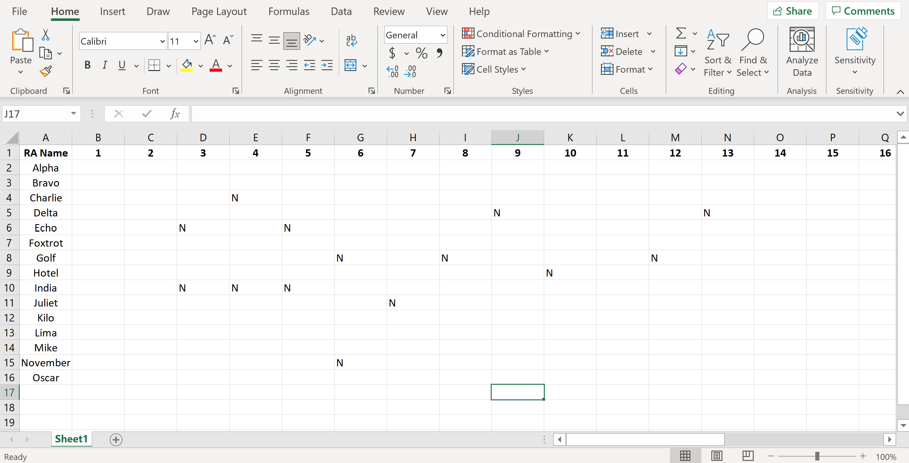

# Automated RA Duty Scheduler
Create an RA Duty Schedule in seconds!

**Author:** David Peterson - dpeterson23@vt.edu

If you experience any bugs/errors or would like to suggest an improvement, please report them to dpeterson23@vt.edu

# How to Use
1) Download and Set-Up PyCharm (Free)
2) Create your Availability Excel file in the correct format
3) Save the Availability Excel file in the correct location and run the program.
4) View your automatically created duty schedule in a calendar like this!

## PyCharm Set-Up
You only have to do these steps for a first-time set-up. The steps below are very general, if you do not have Python installed and are not familiar with coding please reference this site for detailed instructions for set-up procedures with PyCharm: https://www.jetbrains.com/help/pycharm/quick-start-guide.html#create

If you have persistent trouble setting this up, feel free to email me and I am happy to help!

1) Go here: https://www.jetbrains.com/pycharm/download/
2) Download the Community Edition (Free)
3) Once PyCharm is downloaded, go here: https://github.com/dpetersonVT23/RA_Duty_Scheduler
4) Click on the green "Code" button, it will drop down with an "HTTPS" link, click the clipboard to copy this link (it will confirm you copied it)
5) Open PyCharm, click "Get from Version Control", paste the "HTTPS" link you just copied in the URL box
6) Set the directory on your computer in a location you know how to access in the Directory box
7) Click the "Clone" button and you are done with Step 1
8) If you do not have a Python Interpreter configured, please reference https://www.jetbrains.com/help/pycharm/quick-start-guide.html#create for set-up instructions

**Installing Packages**

This program needs support from external libraries to function correctly, once your Python Interpreter is set-up, you can install these packages to ensure everything works correctly for you.

Please install the following packages:
- calendar
- datetime
- matplotlib
- pandas
- random
- sys

## Availability Excel File Set-Up
Set-up the outline for your excel file in accordance with this example image:

1) Ensure the top-left cell contains "RA Name"
2) Enter the days of the month into the following columns
3) Enter the names of the RAs under the cell with "RA Name"

Instructions for RAs to fill out availability correctly:
- BLANK CELL = AVAILABLE FOR DUTY
- N          = NOT AVAILABLE FOR DUTY
- B          = AVAILABLE IF NEEDED (BACKUP)

Please see example below for entering "NOT AVAILABLE FOR DUTY" entries:

Tip: Create a shareable Excel file to give to all your RAs, allow them to input availability by a certain date. Once that date is reached, save the Excel file in the correct location for the program to access it.

Locate the location in your file explorer where you set-up the Python program, open the RA_Duty_Scheduler folder, open the Availability folder, and save your Availability Excel file here.

Last step, you're almost there! Open the program in PyCharm and locate LINE 42 in main.py, this contains the path to your Availability Excel file. Modify it so its name reflects the name of your Availability Excel file. Click the Green Play button and your Calendar will pop-up and automatically be saved to the Schedule folder!

# Advanced Tips

## Partial Month Scheduling

## Not Enough Candidates Warning
